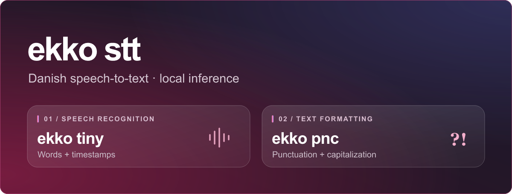

# Ekko STT



Local inference for [Ekko v1 Tiny](https://huggingface.co/RyeAI/ekko-v1-tiny),
a Danish speech recognizer with word timestamps, and
[Ekko PnC](https://huggingface.co/RyeAI/ekko-pnc), its optional punctuation and
capitalization model. This repository contains the Python runtime and the
[browser demo](https://huggingface.co/spaces/RyeAI/ekko-tiny-browser).

| Command | Runtime | Default model |
|---|---|---|
| `ekko tiny` | parakeet.cpp | Q5_0 GGUF |
| `ekko tiny-onnx` | sherpa-onnx | int8 ONNX |

## Run locally

Install [uv](https://docs.astral.sh/uv/), then from this checkout:

```bash
uv sync --locked --no-editable --extra pnc
uv run --no-sync ekko tiny audio.wav --pnc --format json
```

For the ONNX runtime:

```bash
uv sync --locked --no-editable --extra tiny-onnx --extra pnc
uv run --no-sync ekko tiny-onnx audio.wav --precision int8 --pnc --format json
```

The first run downloads model artifacts from Hugging Face and the native
parakeet.cpp library when needed. Downloads use immutable revisions and
SHA-256 checks in [the release manifest](src/ekko/release_manifest.json).
Set `EKKO_OFFLINE=1` after prefetching to prevent network access.

The [browser demo](demo/ekko-tiny-browser/README.md) runs Tiny and PnC locally
through WebAssembly. Audio and transcripts stay on the device.

## Development

```bash
uv sync --locked --extra local
uv run --no-sync python -m unittest discover -s tests -p 'test_*.py'
uv build
```

The source code is MIT licensed. Tiny and PnC weights have their own terms in
their Hugging Face repositories. See [third-party notices](THIRD_PARTY_NOTICES.md)
for runtime dependencies.
